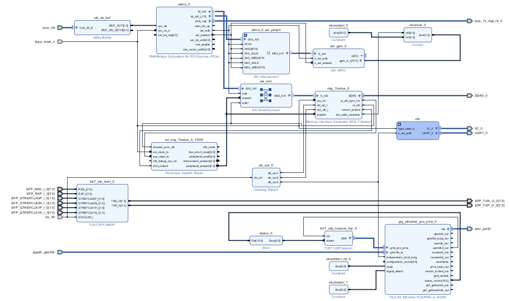

# DAMC-TCK7 Board Support Package

This is a Board Support Package in form of a Vivado project for
[DAMC-TCK7](https://techlab.desy.de/products/amc/damc_tck7). It serves as a
demonstration of board features and as a starting point for custom developments.

This project is maintained by [MicroTCA Technology Lab at DESY](https://techlab.desy.de/).

## Features

### PCIe Gen2 x4

Xilinx driver: [AR# 65444](https://www.xilinx.com/support/answers/65444.html)

### DDR3 memory

### Gigabit Ethernet on AMC port 0

### IBERT on front-panel SFPs

The on-board oscillator are configured by a MicroBlaze processor upon start-up.
Because the Xilinx IBERT core does not have a reset connection, it starts
before the oscillators are configured, which results in QPLLs in MGTs
(COMMON_X0Y2/QPLL_0 and COMMON_X0Y3/QPLL_0) not being locked.

Is is necessary to reset the QPLLs by writing 1 and then 0 to PORT.QPLLRESET
in both QPLLs. Another alternative solution is to configure the FPGA for the
second time; the oscillators are already stable at this point and the QPLLs
will lock.

### On-board clock configuration

## Recreating project

**This project requires Vivado version 2017.4**

In Vivado:

1. `cd` into **project** dir
2. `source ../scripts/recreate.tcl`
3. `source ../scripts/bd.tcl`
4. `source ../scripts/wrapper.tcl`

To compile the project:

1. `launch_runs impl_1 -to_step write_bitstream -jobs 4`
2. Grab a coffee, this is going to take some time

## Setting up software development environment

1. Create block diagram and it's wrapper (see "Recreating project")
2. From Vivado open SDK (File -> Launch SDK)
3. For **Exported location** select `<TOP>/exported_hw`, for **Workspace** select `<TOP>/sdk`
4. Xilinx SDK will open
5. Import project: File -> Import -> Existing Projects into Workspace
6. **Select root directory:** to `<TOP>/sdk`
7. Make sure that both `tck7_board_controller` and `tck7_board_controller_bsp` are selected
8. Press **Finish**

## Commiting changes

### Block diagram

From **project** dir:

`write_bd_tcl -include_layout  -force ../scripts/bd.tcl`

### Update MicroBlaze init script

1. Copy generated .elf into `<TOP>/sdk/elf`
2. Add .elf to Vivado project
3. Set parameters `SCOPED_TO_CELLS` to `microblaze_0` and `SCOPED_TO_REF` to `system`

### Project settings

If you need to update recrete.tcl, run:

`write_project_tcl -use_bd_files -force ../scripts/recreate.tcl`

Please be careful as there are some hand-crafted modification in **recreate.tcl**
